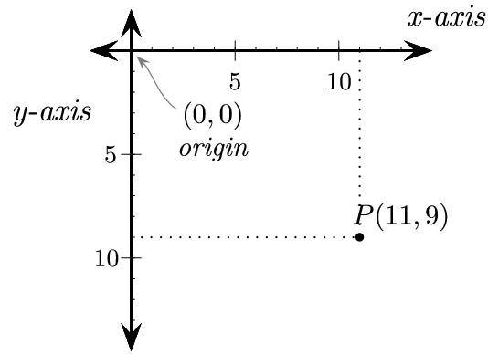
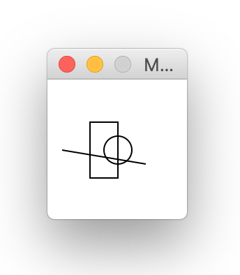

## Materials

* [Graphics](https://mcsp.wartburg.edu/zelle/python/graphics.py)
* [Graphics Reference](https://mcsp.wartburg.edu/zelle/python/graphics/graphics.pdf)

## Overview

For today's lab, download the latest version of
[graphics.py](https://mcsp.wartburg.edu/zelle/python/graphics.py).
Open a new Project in PyCharm, and include this
`graphics.py` file in your directory.  You
are now ready to work through the lab.

## Step 1: Faces

When we draw on the screen, we first need to
be familiar with the coordinate system. We denote the width as x and
the height as y.  Most computer graphics modules
specify that the x, y origin (0,0) is located in the upper-left corner
of the screen, with x increasing to the right and y increasing
downwards, as shown here.

{: .img-fluid}

*Image source: (http://programarcadegames.com/chapters/05_intro_to_graphics/Computer_coordinates_2D.png)*

There are three common shaped we can draw this graphics package: a circle, a
rectangle, and a line.  Write the following lines of code in
a Python file called `faces.py` and execute the program.

    from graphics import *

    def main():
        win = GraphWin("My First Drawing", 100, 100)

        c = Circle(Point(50, 50), 10)
        r = Rectangle(Point(30, 30), Point(50, 70))
        s = Line(Point(10, 50), Point(70, 60))

        c.draw(win)
        r.draw(win)
        s.draw(win)

        win.getMouse()
        win.close()

    main()

You should see an image like this:

The above program first imports the graphics package, making all
of the objects accessible to the program. Then,
in the main method, a `GraphWin` object is created, with
a width of 100 pixels, and height of 100 pixels.

Each of the three shapes rely on the `Point` object, which holds
two coordinates, one in the x dimension, and one in the y dimension.

A `Circle` is created using a `Point` for the center, followed
by the radius of the circle. A `Rectangle` takes two arguments, the
first a `Point` for the upper-left coordinate of the rectangle, and
another `Point` for the lower-right coordinate. A `Line` takes two arguments,
the first `Point` for the starting x, y coordinate, and the
last `Point` for the ending x, y coordinate.

After being created, each of the above objects is then drawn to the
`GraphWin` object to be seen on the screen. Finally, the `GraphWin` will
wait until the mouse is clicked, then close the window.

### Task: Draw a Face

Use `Circle`, `Rectangle`, and `Line` objects to draw a face on the screen. At a minimum, the face should
have

* eyes,
* ears,
* a mouth and
* a nose.





## Step 2: Colors

Three different portions of our drawing can be altered to include colors. Recall
the hexadecimal representation of colors discussed earlier in class, where the
computer understands a color to be composed of three components, Red, Green, and Blue.
Each of the three functions below take a hex string as an argument denoting the color.

The `setBackground` method of `GraphWin` objects will paint the whole screen the given color.

The `setFill` method for a graphics object changes the color to be painted
within the object. The
`setOutline` method changes the color to use for making
the border of an `ellipse` or `rect`.

    win.setBackground("#ABCDEF")

    c.setFill("#00FFFF")
    r.setOutline("#FF0000")

It will be convenient to have some of our basic colors defined in a dictionary.

    COLORS = {"black":"#000000", "white":"#FFFFFF",
              "red":"#FF0000", "green":"#00FF00",
              "blue":"#0000FF", "yellow":"#FFFF00",
              "orange":"#FFA500", "hendrixorange":"#F58025",
              "purple":"#9B30FF"}

### Task: Add Colors to Your Face

Use the above shapes and color functions, along with any others you might
find useful on the
[Graphics Reference](https://mcsp.wartburg.edu/zelle/python/graphics/graphics.pdf)
page, to enhance your earlier image of a face.



## Step 3: Faces in Space

All of our images so far have been static. To add animations, we need to start
remembering the state of our images and creating methods for how it will change.
The natural way to do this is to create new object, and in particular, we will
be representing Faces floating in space.

We will represent a Face with a class in Python. The face will need to remember
the x,y coordinates for the center of the face. Notice how the draw function
abstracts away the initial face to be centered around any x,y coordinates. This will
let us move the face around the screen.  Of course, you should use
your own face-drawing code in place of the example code shown below.

    class Face:

        def __init__(self, x:int, y:int):
            self.x = x
            self.y = y
            self.c = Circle(Point(self.x, self.y), 10)
            self.r = Rectangle(Point(self.x - 20, self.y - 20),
                               Point(self.x, self.y + 20))
            self.s = Line(Point(self.x - 40, self.y),
                          Point(self.x + 20, self.y + 10))

        def draw(self, win:GraphWin):
            self.c.draw(win)
            self.r.draw(win)
            self.s.draw(win)

Let's make our window a little bigger for what is coming next.
Also, we will collect our `Face` instances in a list
called `faces`, declared inside `main()`, add a new
`Face` to the list, then draw every `Face` in the list.

    def main():
        win = GraphWin("Making Faces", 640, 480, autoflush=False)

        faces = []

        faces.append(Face(50, 50))

        for f in faces:
            f.draw(win)

        win.getMouse()
        win.close()

Try moving your face around the screen by
altering the arguments you use to create the `Face` in the
setup function.

### Task: Multiple Faces

Change the `main` function to add multiple faces at random locations
around the screen.



## Step 4: Movement

With the faces being drawn by an object, we
can now make these objects move. Add new components to
your `Face`, called `vx` and `vy`, to capture
the velocity of the `Face`. For now, initialize them to 1, so they will
be moving at a speed of 1 pixel per update, as shown here:

        self.vx = 1.0
        self.vy = 1.0

Next, add a new method to your `Face`
called `update`. When called, this function will change the
values of `self.x` and `self.y` by the velocity, and
thus simulate movement. Also, make sure that you call the move
method on every object of your face.

    def update(self):
        self.x += self.vx
        self.y += self.vy
        self.c.move(self.vx, self.vy)
        self.r.move(self.vx, self.vy)
        self.s.move(self.vx, self.vy)

Finally, inside the `main` function, add a call to
the `update` method of each face after calling the
`draw` method. The rest of your `main` function will
look like this:

    for i in range(1000):
        for f in faces:
            f.update()
        update(30)

Woah, it is moving! This will update the location of the shape 1000 times,
thus moving it around the screen. The `update(30)` line at the end will keep
the `for` loop from running more than 30 times per second, which is a decent
frame rate for our animation.

### Task: Bouncing

Currently, the faces disappear after a
while, because they moves off the bottom of the screen.  We would like
to keep them bouncing inside the window. Add in checks to
the `update` method of the `Face` to reverse the appropriate velocity
component when a face hits a wall, by multiplying the velocity in
that dimension by -1.

### Task: Random speeds

Abstract the velocities so they are initialized by parameters in
the `__init__` method, and augment your setup function to
choose random velocities between -1 and 1 for both the x and y
dimension for each `Face` created. You should now have faces
moving in all directions and bouncing off of all the walls of the
window.

## Step 5: Extensions

Research two of the following extensions on the
[Graphics Reference](https://mcsp.wartburg.edu/zelle/python/graphics/graphics.pdf)
page and augment your animation above.

### Task: Face sizes

Add a size component to
your `Face`, so you can also initialize
the size. Change your `main` method and `Face` to account
for this new size component, and test it out by drawing smaller and
larger faces.  Make sure your locations are still chosen so that the
face is always completely visible on the screen!

### Task: Mouse and keyboard input

Make your animations interactive by reacting to input from the
mouse and the keyboard. For example you could have new Faces appear
when and where the mouse is clicked, or you could increase or
decrease the velocity of all the Faces when certain keys are pressed.

### Task: Animated faces

Alter your update method of the Face to change the internal pieces of the face
in a cyclic pattern. For example, the face could smile for a few timesteps, then frown,
and then go back to smiling. Or the eyeballs could be moving up and down, left and right.

### Task: Face collisions

Right now all the faces pass through each other when they move.
Add a collision detection method, that checks each pair of faces to see if they
are intersecting, and if so, makes the smaller one disappear.

### Task: Images

Learn how to import images into your program, and make them move around the
screen as we did with the Face above.

## What to Hand In

* `faces.py`.


